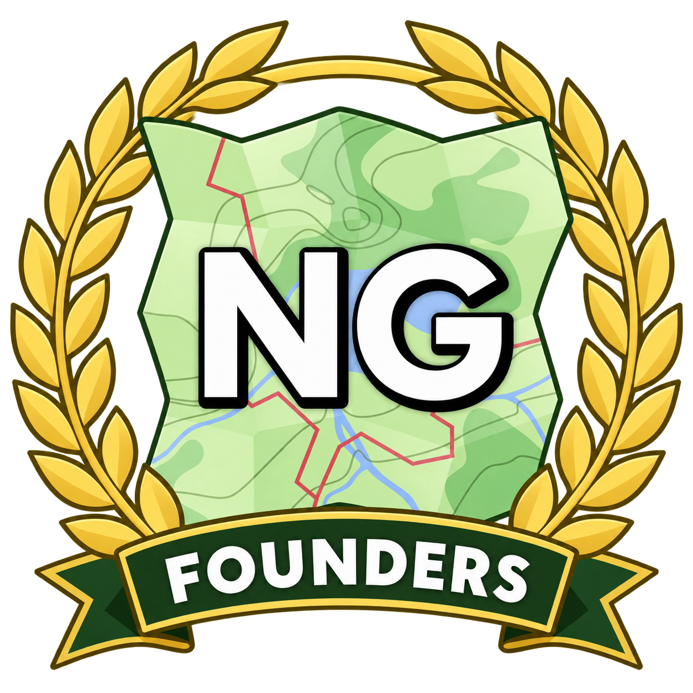

# Founders badge

Proposal for [#114](https://github.com/openstreetmap-ng/openstreetmap-ng/issues/114).
The folded green map, blue waterways and white NG lettering derive from the
project's `resources/logo.webp`. A gold laurel and a forest-green FOUNDERS ribbon
identify the contributors, donors and testers who helped establish the project.

The PNG has a transparent background. It is intended as a founders-group identity
asset at medium/large display sizes, not as a replacement for the project's main
logo or favicon. Use alt text: "OpenStreetMap-NG founders".

Production: generated with OpenAI image generation using the existing OSM-NG logo
as an image reference, then visually checked for lettering and recognizable map
identity. The PNG is the delivered raster artwork; no editable vector/XCF source
is claimed. Existing project/logo rights continue to apply to the referenced
identity. Maintainers can review the design independently of product integration.
